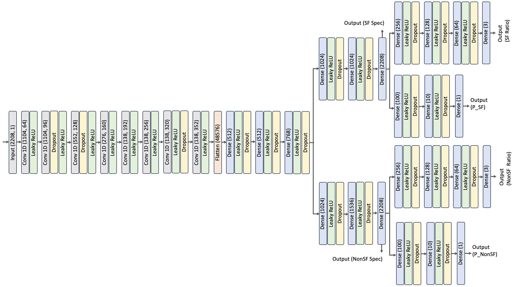

# Spectra Decomposition
Dissection of composite spectra of galaxies into individual components using deep supervised learning techniques.

# Summary

Recent advancements in galaxy research, particularly through Integral Field Unit (IFU) surveys like MaNGA, have significantly deepened our understanding of the diverse stellar populations and physical processes within galaxies. While these surveys provide more precise measurements of key parameters, their limited scope of IFU surveys restricts their broader application. In contrast, single-slit spectroscopic surveys like SDSS, which offer an averaged view by capturing integrated light from galaxies, face difficulties in accurately extracting specific details due to the overlapping contributions from different regions. 

To bridge such gaps, we have considered an innovative two-component scenario in which a model decomposes SDSS spectra into Active Galactic Nuclei (AGN) and Star-Forming (SF) components, utilizing MaNGA spectra for training. This approach, which leverages deep supervised learning techniques trained on IFU survey data, enables the dissection of composite spectra into individual components, providing a clearer quantification of each population’s contribution. Our results show that removing star-forming ’contamination’ from AGN galaxies can position the galaxies to a more limited area on BPT diagrams.

# This Repository

To test our trained model, please download the model weights and save it in the "Weights" folder. Then use the piplene.ipynb file to test the model on your data. Input data to the model must be prepared considering the following requirements:

Provide one file that contains the input spectra as follows. Save the file as data/input.npy

1- Input spectra must be resampled to 2A wavelength bins between 3700 A and 8114 A. Therefore, each input spectra must have 2208 elements.
  
2- All the major emission lines (Ha, Hb, O3, N2 and S2) need to have signal-to-noise ratio values greater than 8.
  
Provide one file that contains the corresponding weight of each spectra. Save it as data/weights.npy

We normalize each MaNGA spectra by subtracting the median value between 4000 A and 7000 A, which covers the four emission lines required for placement on a BPT diagram.
  

# The deep decomposition model
Our Deep Decomposition Model (DDM) consists of a model with five regressors, each with its own loss function (i.e., five outputs). A detailed information of the
structure of the model is below:

